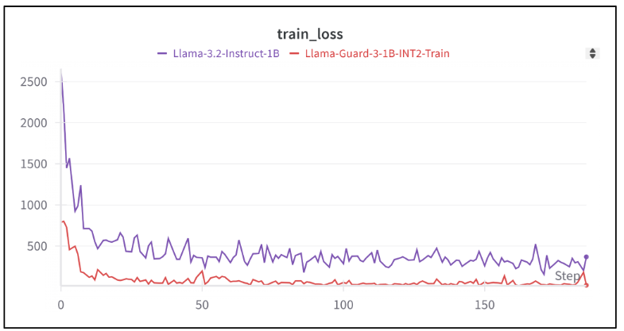
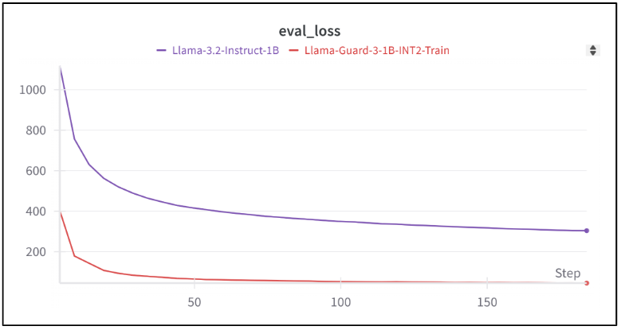
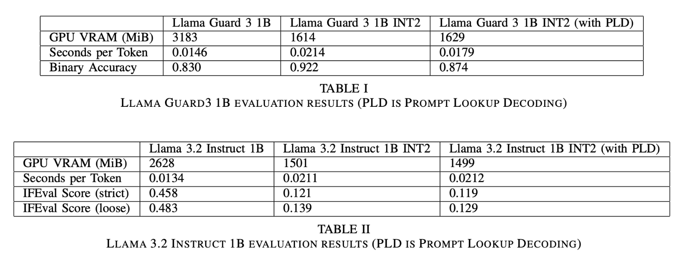

# hpml-final
Brandon Zhang and Chak Li
## Description and Credit
This is our final project for COMS6998 High Performance Machine Learning. We explore 2-bit quantization of Llama 3.2 models using BitDistiller to try and optimize inference performance, in particular Llama Guard 3 1B (a toxic content classification model) and Llama 3.2 Instruct 1B (instruction-following model). Our goals are to reduce inference latency and GPU usage while still trying to retain performance on task-specific benchmarks. For Llama Guard 3 1B we evaluate binary accuracy on ToxicChat, while for Llama 3.2 Instruct 1B we evaluate score on the IFEval dataset. We also experiment with Prompt Lookup Decoding to help speed up inference, and altogether benchmark 3 variants per model: unquantized, INT2 quantized, and INT2 quantized with prompt lookup decoding. A high-level view of the repository setup:
* `BitDistiller-Fork`: a copy of BitDistiller that we tweak to be compatible with Llama 3.2 models. We primarily updated the transformers library and made some modifications to resolve functional errors (e.g. clippings, training step, forward layer), as well as integrate ToxicChat into the teacher model dataset generation step. We also include some of our intermediate output (e.g. weight clippings, teacher model datset). Otherwise, the fork generally remains the same as the original, found here: https://github.com/DD-DuDa/BitDistiller/tree/main
* `eval`: This is where the majority of our inference code lives. 'eval.py' is our main inference engine, and the rest are helper files (e.g. for preprocessing or model loading). `test_quant.py` loads the 2-bit model, adapted from https://github.com/mit-han-lab/llm-awq/blob/main/awq/entry.py
* `instruction_following_eval`: a copy of the IFEval data and evaluation code, so that we can properly generate instruction following scores for our generated JSON files. The original can be found here: https://github.com/google-research/google-research/tree/master/instruction_following_eval

We also include ToxicChat data from: https://huggingface.co/datasets/lmsys/toxic-chat

BitDistiller, IFEval and ToxicChat are additionally cited in our report.

## Prerequisites

### Packages
1) All the requirements in requirement.txt in BitDistiller-Fork (install with `pip install -r requirement.txt`)
2) `pip install wandb` to run the wandb upload script

### Models

1) Llama Guard 3 1B: `$ huggingface-cli download meta-llama/Llama-Guard-3-1B  --local-dir Llama-Guard-3-1B`
2) Llama Instruct 3.2 1B: `$ huggingface-cli download meta-llama/Llama-3.2-1B-Instruct  --local-dir Llama-3.2-1B-Instruct`

## Training
For training, we used LambdaLabs to provision H100 80GB GPUs.

### Setup Instance + Scp and Ssh with LambaLabs:
This is an example of how to setup an instance and copy a file over.
0) select "Lauch instance", select the instance type, and create a new file system <p>
1) download the ssh key to your local when you create the instance <p>
2) `scp -i <path to pem>/my-ssh-key.pem <path to py package>/hpml-final.zip ubuntu@<gpu ip>:/home/ubuntu` <p>
3) `ssh -i <path to pem>/my-ssh-key.pem ubuntu@<gpu ip>` <p>

### Training on LambdaLabs GPU:
This is the QAT step for BitDistiller. It assumes asymmetric clippings and teacher model dataset have all been generated, and these are included in our repo. For more information on how to generate them, please see the README in `BitDistller-Fork`. <p>

0) `python -m venv venv; . venv/bin/activate` <p>
1) Clone this repository (hpml-final) <p>
2) `cd hpml-final/BitDistiller-Fork/train` <p>
3) `pip install -r ../requirement.txt` <p>
4) `pip install -U "huggingface_hub[cli]"` <p>
5) `huggingface-cli login` <p>
6) `huggingface-cli download meta-llama/Llama-Guard-3-1B  --local-dir /home/ubuntu/Llama-Guard-3-1B` <p>
7) `export CLIP_PATH=../quantization/clip_cache/hf-llama3-guard-1b/int2-g128.pt` <p>
8) `export MODEL_PATH=<PATH_TO_UNQUANTIZED_MODEL>` <p>
9) `sh train.sh ../data/generation/datasets/llama-guard-3-1b/toxicchat_T0.7_N1024_S42_3000.json save log 2` <p>

The steps here are for Llama Guard 3 1B. The steps for Llama 3.2 Instruct 1B are identical, except replacing the Llama-Guard-3-1B files with the Instruct 1B equivalent (all provided in the repository, besides the huggingface model).

### To Overcome the CUDA capability issue:
We occasionally observed CUDA issues on LambdaLabs, and found the following workaround:
```
NVIDIA H100 80GB HBM3 with CUDA capability sm_90 is not compatible with the current PyTorch installation.
The current PyTorch install supports CUDA capabilities sm_37 sm_50 sm_60 sm_70 sm_75 sm_80 sm_86.
```
Upgrade the torch version as:
```
pip3 install torch==2.3.1 torchvision==0.18.1 torchaudio==2.3.1 --index-url https://download.pytorch.org/whl/test/cu121
```

### Uploading Training Data to Weights and Biases

After training, the `save` folder will have `trainer_state.json`. Let this be <PATH_TO_JSON>.

Then do:
`python convert_train_log_to_wandb.py --log_path <PATH_TO_JSON>` and login to your account when prompted.

## Evaluation

### Prerequisites
* In your `save` folder from the training step, copy over all top-level files (not including the checkpoint folders). The folder you copy this to will be your <PATH_TO_UNQUANTIZED_MODEL_POST_QAT>.
* Follow steps 1 and 2 of the README in `BitDistiller-Fork/inference`. This will generate the quantized model checkpoint. This will be your <PATH_TO_QUANTIZED_MODEL_CHECKPOINT>.

### Monitoring GPU during Evaluation
```
watch -n 1 nvidia-smi
```

### Evaluating Llama Guard 3 1B on ToxicChat
```
$ cd eval
[Unquantized model] $ python eval.py --model 1B-BF16 --path Llama-Guard-3-1B --dataset toxic
[Quantized model] $ python eval.py --model 1B-INT2 --path <PATH_TO_UNQUANTIZED_MODEL_POST_QAT> --w_bit 2 --load_quant <PATH_TO_QUANTIZED_MODEL_CHECKPOINT> --original_model <PATH_TO_ORIGINAL_UNQUANTIZED_MODEL> --dataset toxic
[Quantized model with Prompt Lookup Decoding] $ python eval.py --model 1B-INT2 --path <PATH_TO_UNQUANTIZED_MODEL_POST_QAT> --w_bit 2 --load_quant <PATH_TO_QUANTIZED_MODEL_CHECKPOINT> --original_model <PATH_TO_ORIGINAL_UNQUANTIZED_MODEL> --dataset toxic --lookup
```
This will print out the time/token and the binary accuracy at the end. <p>
To profile the code, run with the `--profile` option.

### Evaluating Llama Instruct 3.2 1B on IFEval

```
$ cd eval
[Unquantized model] $ python eval.py --model 1B-BF16 --path Llama-3.2-1B-Instruct --dataset ifeval --response result/Llama-3.2-1B_ifeval/response.jsonl  --instruct
[Quantized model] $ python eval.py --model 1B-INT2 --path <PATH_TO_UNQUANTIZED_MODEL_POST_QAT> --w_bit 2 --load_quant <PATH_TO_QUANTIZED_MODEL_CHECKPOINT> --original_model <PATH_TO_ORIGINAL_UNQUANTIZED_MODEL> --dataset ifeval --response result/Llama-3.2-1B-Instruct_ifeval/response.jsonl` --instruct
[Quantized model with Prompt Lookup Decoding] $ python eval.py --model 1B-INT2 --path <PATH_TO_UNQUANTIZED_MODEL_POST_QAT> --w_bit 2 --load_quant <PATH_TO_QUANTIZED_MODEL_CHECKPOINT> --original_model <PATH_TO_ORIGINAL_UNQUANTIZED_MODEL> --dataset ifeval --response result/Llama-3.2-1B-Instruct_ifeval/response.jsonl --instruct --lookup
$ cd ..
$ python3 -m instruction_following_eval.evaluation_main --input_data=./instruction_following_eval/data/input_data.jsonl --input_response_data=./eval/result/Llama-3.2-1B-Instruct_ifeval/response.jsonl --output_dir=./eval/result/Llama-3.2-1B-Instruct_ifeval/
```

## Results
### Training and Evaluation Loss



All models were trained for 1 epoch, 3000 samples each.

### Inference Benchmarks


All benchmarks were obtained using an NVIDIA 4070 Super GPU, 12 GB VRAM.

## Observations
* We see much smaller GPU VRAM usage as a result of BitDistiller for both Llama Guard 3 1B and Llama 3.2 Instruct 1B. Still some potential for improvement, as Meta's Llama Guard 3 INT4 prunes and also INT4 quantizes the embeddings (BitDistiller focuses on the liunear layers), allowing it achieve a model size of 458 MB.
* Surprisingly, inference latency, measure in seconds/token, increases after INT2 quantization. However, for Llama Guard 3 1B INT2 we can bring it back closer to the original using Prompt Lookup Decoding. We don't see the same improvement for Llama 3.2 Instruct 1B, perhaps because the output may not generally overlap with the input (whereas for Llama Guard 3 1B all the expected outputs can be found in the input).
  * Kernel implementation is one area of improvement, for Llama Guard 3 1B the profiler shows that on 200 iterations around 73% of CUDA time is spent doing `quant_matmul_kernel`, the triton kernel for INT2 quantization. This is in contrast to the unquantized model where around only 48% is spent doing `aten::mm`. The original BitDistiller implementation uses a mixture of AWQ kernels and the triton kernel, and work such as BitBlas (https://github.com/microsoft/BitBLAS) may have more positive outcomes for inference speed.
  * The fact that we used a smaller model (by LLM standards) may be relevant, perhaps if we used a larger one we'd see better results as memory movement is more likely to be a bottleneck.
* INT2 Llama Guard 3 1B does indeed retain the accuracy as the original model on the binary classification task. However, Llama 3.2 Instruct 1B sees a sharp drop in benchmark performance. This is perhaps attributable to the increased difficulty of instruction-following vs classification, and perhaps the INT2 model needed more time to train and properly learn during the QAT phase.
* Overall, we see that INT2 quantization with BitDistiller is a promising direction for quantizing Llama 3.2 class of models. This was a great oppurtunity to learn about extreme quantization and LLMs.


